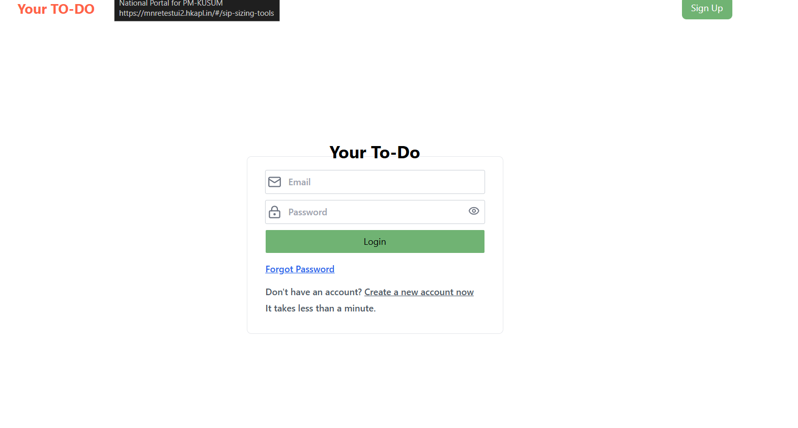
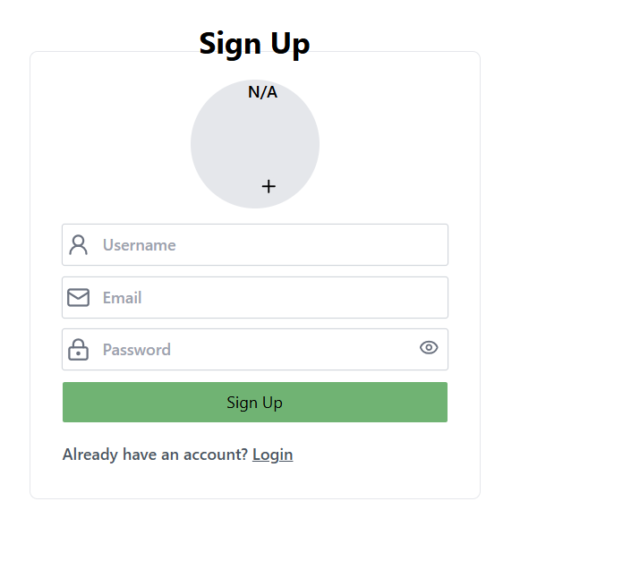
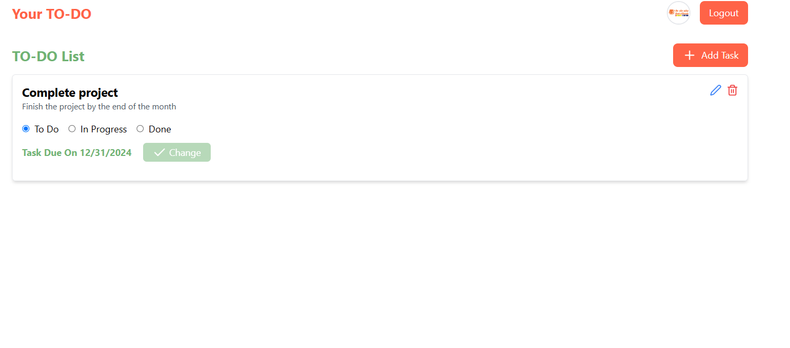

# Full-Stack Todo Application

This project is a Full-Stack Todo Application where you can add, update, delete, and view tasks. The project is built with **React JS** for the frontend and **NestJS** for the backend.

## Table of Contents
- [Full-Stack Todo Application](#full-stack-todo-application)
  - [Table of Contents](#table-of-contents)
  - [Prerequisites](#prerequisites)
  - [Backend Setup](#backend-setup)
    - [Backend Installation](#backend-installation)
    - [Frontend Setup](#frontend-setup)
- [Screenshots](#screenshots)

---

## Prerequisites

Before starting, ensure you have the following installed on your machine:
- [Node.js](https://nodejs.org/) (version 14 or higher)
- [npm](https://www.npmjs.com/) (version 6 or higher)
- [Git](https://git-scm.com/)

---

## Backend Setup

The backend of the project is built using **NestJS**, a progressive Node.js framework.

### Backend Installation
1. Clone the repository:
   ```bash
   git clone https://github.com/Radhika-gif-dot/myfullstackproject.git


2. Navigate to the backend directory:
cd backend
Install the dependencies:

npm install
Running the Backend
Development Mode:
To run the backend server in development mode:

npm run start:dev
This will run the backend on http://localhost:8080


### Frontend Setup
The frontend is built using ReactJS, providing an interactive user interface for managing tasks.

1. Frontend Installation
Navigate to the frontend directory:
cd frontend

2. Install the dependencies:
npm install

3. Running the Frontend
Development Mode:
To run the frontend application in development mode:
npm start
This will run the frontend on http://localhost:3000.

# Screenshots

1. Login Page 
   

2. Signup page
   

3. Dashboard page
   